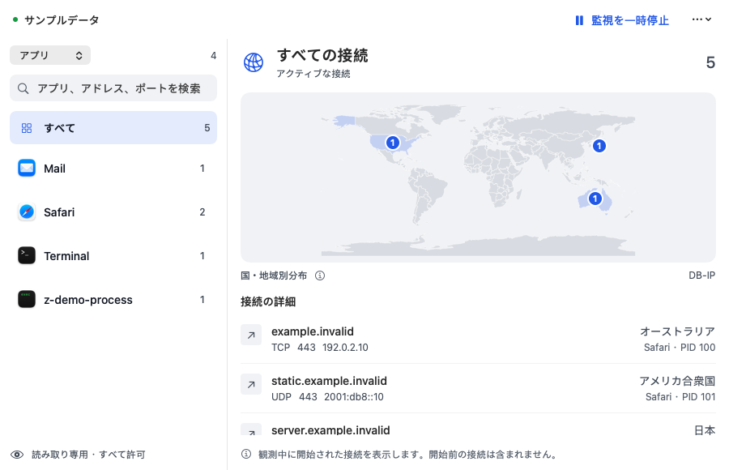
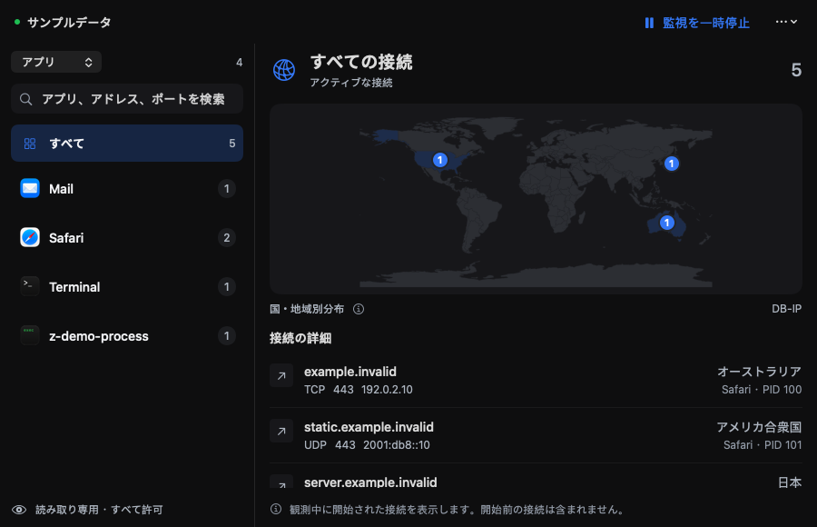
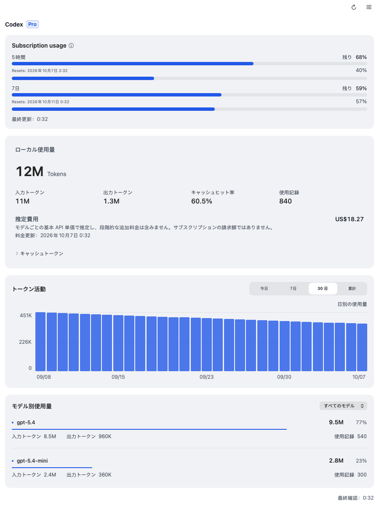
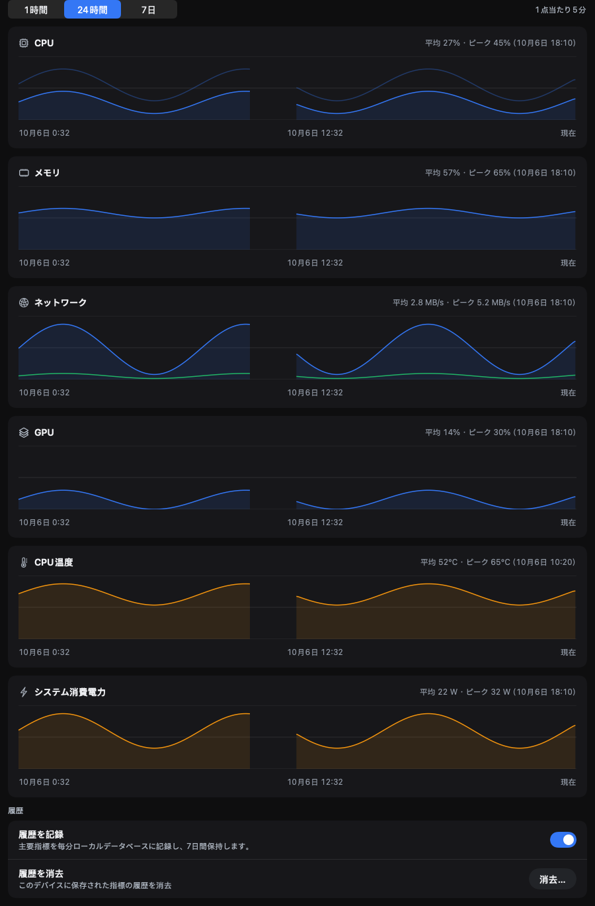
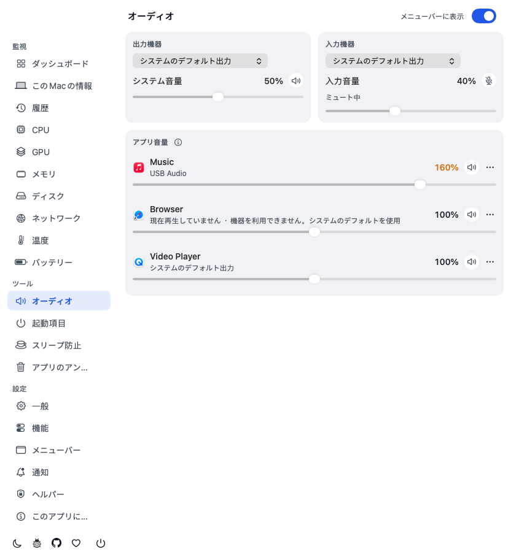
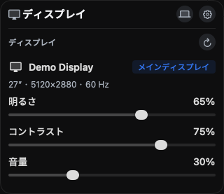
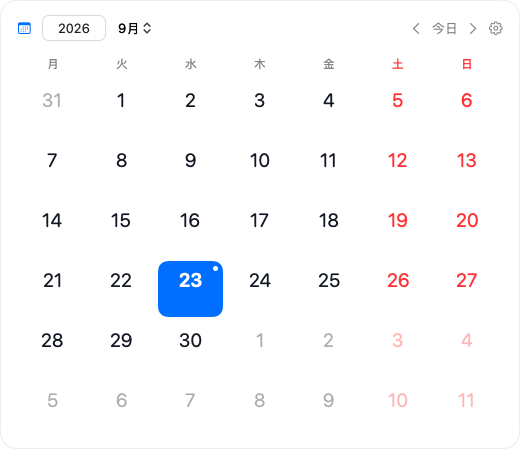
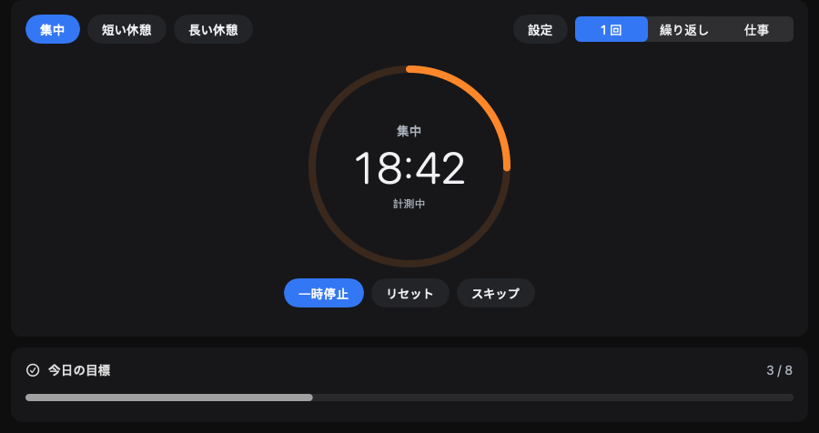

<div align="center">


# XStats

**Mac のメニューバーで使える、システム監視と日常のツール。**

CPU、メモリ、ネットワーク、温度をひと目で確認し、詳細を開いて推移やアプリの使用状況を見られます。AI 使用量、カレンダー、ファン制御などのツールは必要なときに有効にできます。

[](https://github.com/ysicing/xstats/releases)
[](https://github.com/ysicing/xstats/actions/workflows/ci.yml)
[](https://github.com/ysicing/xstats/releases)
[](LICENSE)
[](https://twitter.com/YsiCing)

[最新版をダウンロード](https://github.com/ysicing/xstats/releases) · [機能](#機能) · [インストール](#インストール) · [データとプライバシー](#データとプライバシー) · [変更履歴（中国語）](CHANGELOG.md)

[简体中文](README.md) · [English](README.en.md) · **日本語** · [한국어](README.ko.md)


</div>

<p align="center">
  
  
</p>

## 機能

XStats は Swift、AppKit、SwiftUI で開発した、無料のオープンソースのネイティブアプリです。アカウント登録は不要です。

### メニューバーの表示

指標は**個別表示**、**ひとつにまとめて表示**、**アイコンのみ**から選べます。表示する項目、並び順、スタイル（文字、アイコン、リング、進捗バー、履歴グラフ）を変更できます。

**機能の有効化とメニューバー表示を別々に管理します。** 設定 → 機能で基本モニタリングをオフにすると、その監視、通知、新たな履歴記録を停止し、メニューバー項目を削除します。既存の履歴は保持されます。メニューバーに追加すると機能も有効になり、項目を外しても機能は有効なままです。収集は表示、履歴、通知の必要に応じて行い、システムウィジェットは独立して更新します。 ディスプレイのスイッチは明るさ、コントラスト、音量などのパラメータ読み取りと調節のみを制御します。オフでもディスプレイ情報とメニューバー項目は利用できます。

### システム監視

| モジュール | 内容 |
|---|---|
| **CPU** | ユーザー / システム / アイドルの使用率、コア別とコアグループの負荷、平均負荷、周波数と温度、熱負荷の警告 |
| **GPU** | グラフィックスの使用率、コア数、温度と消費電力 |
| **メモリ** | メモリプレッシャー、アプリ / 圧縮 / キャッシュの内訳、スワップ容量とスワップ速度 |
| **ディスク** | 容量、読み書きの速度、アプリ別 I/O ランキング、SMART 健全性 |
| **ネットワーク** | アップロード / ダウンロードの速度、ネットワークインターフェイス、接続の概要 |
| **バッテリーと Bluetooth** | 残量、電源、健全性、充放電回数、Bluetooth 機器の残量 |
| **温度とファン** | 温度センサー、ファン回転数、消費電力 |
| **ディスプレイ** | 解像度、スケーリング、リフレッシュレート。DDC/CI 対応の外部ディスプレイでは明るさ、コントラスト、音量を調節可能 |

周波数、温度、消費電力などの値は、機種と macOS が提供する場合に表示されます。

<p align="center">
  
  
</p>

### ネットワークモニター

> **1.0** で提供予定です。以下の機能とスクリーンショットは開発ブランチのものです。

アプリ、プロセス、ドメイン、国または地域ごとにネットワーク接続を確認できます。検索、アクティブな接続の絞り込み、世界地図での分布表示に対応します。

- **読み取り専用**：すべての接続を許可し、通信内容は読み取らず、接続履歴も保存しません。
- **必要時のみ動作**：ページが表示中かつ一時停止していないときだけ読み取り、メモリ内に最大 512 件を保持します。
- **独立コンポーネント**：macOS 15 以降で任意に有効化できます。初回は XStats Network Monitor コンポーネントをインストールし、ネットワーク機能拡張を許可します。コンポーネントは独立して更新されます。

<p align="center">
  
  
</p>

スクリーンショットはデモデータです。地図はオフラインの IP 地理データベースで国・地域を特定し、端末の正確な位置を示すものではありません。

### AI 使用量

メニューバーで Codex / Claude Code の使用量を確認できます。

- **トークン統計**：今日は時間ごと、直近 7 日 / 30 日は日ごとに集計し、年間のアクティビティヒートマップも表示します。
- **サブスクリプション利用枠**：使用済み / 残りの割合、リセット時刻、プラン情報。Sub2API を代替ソースとして設定できます。
- **推定費用**：公開 API 基本単価から米ドル / 人民元で算出します。サブスクリプションの請求額ではありません。

ローカル統計は CLI のセッションログを読み込みます。利用枠の照会には対応する CLI へのログインが必要です。

### ツール

| ツール | 説明 |
|---|---|
| **ファン制御** | 対応機種で自動 / 手動制御を切り替え |
| **スリープ防止** | システムや画面を起動状態に保ち、蓋を閉じた状態での動作も設定可能 |
| **クリーンアップとアンインストール** | キャッシュ、ビルド成果物、アプリの残りファイルを確認してから削除 |
| **起動項目** | ログイン項目とバックグラウンドの起動項目を管理 |
| **ネットワーク診断** | 速度テスト、DNS 照会、外部接続経路の確認、公開 IP の所在地とクリーン度、接続テスト |
| **メニューバーカレンダー** | 旧暦、中国の祝日と振替出勤日、暦注、カレンダーの予定とリマインダー |
| **オーディオ** | システム音量と入出力機器の切り替え。macOS 14.4 以降ではアプリ別の音量と出力先を調節（本機で処理） |
| **ポモドーロと目の休憩** | 集中と休憩のタイマー、複数画面の休憩表示、ミニ HUD |
| **プロセス管理** | 検索、並べ替え、アプリ別のグループ化、プロセスの終了 |

オプションのモジュールは初期状態でオフで、設定から有効にできます。ファン制御や蓋を閉じた状態のスリープ防止など特権が必要な操作には、アプリ内から補助ツールをインストールして許可を与える必要があります。

<details>
<summary>その他のスクリーンショット</summary>

スクリーンショットの使用量、利用枠、単価、デバイス状態、予定はデモデータです。

<p align="center">
  
  
</p>
<p align="center">
  
  
</p>
<p align="center">
  
  
</p>
<p align="center">
  
  
</p>
<p align="center">
  
  
</p>

</details>

### 連携

- **デスクトップウィジェット**：システム概要、ポモドーロ、AI 利用枠、カレンダーと月表示、「明日は出勤？」、IP クリーン度、公開 IP。
- **表示言語**：简体中文、繁體中文、English、日本語、한국어、Deutsch、Español、Français、العربية。
- **ディープリンク**：ランチャー、ショートカット、ターミナルから `xstats://` でよく使う画面を開けます。オフのモジュールは設定画面に移動し、自動では有効になりません。

```bash
open 'xstats://open/connections'   # ネットワークモニターを開く
open 'xstats://panel/cpu'          # CPU ポップオーバーを表示
```

全ルートと操作は[ディープリンク仕様](docs/DEVELOPMENT.md#xstats-深链)を参照してください。

## インストール

**Apple Silicon Mac と macOS 14 以降**が必要です。

```bash
brew tap ysicing/tap
brew trust ysicing/tap
brew install --cask xstats
```

または [GitHub Releases](https://github.com/ysicing/xstats/releases) から DMG を入手し、XStats を「アプリケーション」にドラッグします。アプリがアップデートを確認し、インストールするかどうかはユーザーが選べます。

## データとプライバシー

監視データ、ローカルの履歴、AI トークン統計は本機で処理し、XStats の更新サービスにはアップロードしません。次の機能は外部サービスに接続し、オフにするか必要なときだけ利用できます。

- **アップデートの確認**：現在のバージョンとインストール ID のハッシュを送り、更新情報を取得します。
- **AI 利用枠の照会**：ローカルの CLI ログインで提供元に照会します。代替ソースを設定した場合は、指定したサーバーに接続します。
- **費用の推定**：公開モデル単価と参考為替レートを必要に応じて取得し、セッションログやトークン統計は送信しません。
- **ネットワークモニター**：コンポーネントと公開地理データベースのダウンロード時に接続します。接続記録や接続先 IP はアップロードしません。
- **ネットワーク診断**：公開 IP、所在地、速度テスト、DNS、接続テスト、グローバルプローブは各サービスへ接続します。グローバルプローブの対象と結果は他の人が照会できる場合があります。

詳細は[プライバシーポリシー（英語）](Packages/XStatsKit/Sources/XStatsUI/Resources/Legal/Privacy.en.md)と[利用規約（英語）](Packages/XStatsKit/Sources/XStatsUI/Resources/Legal/Terms.en.md)を参照してください。

## ビルドと貢献

Xcode 26+、Go 1.25+、[Go Task](https://taskfile.dev/)、[XcodeGen](https://github.com/yonaskolb/XcodeGen) が必要です。

```bash
task test
task build BUMP=0 INSTALL=0
```

Issue と Pull Request を歓迎します。環境構築とリリース手順は [DEVELOPMENT.md（中国語）](docs/DEVELOPMENT.md)、モジュールの境界と実装上の制約は [ARCHITECTURE.md（英語）](docs/ARCHITECTURE.md)を参照してください。

## 変更履歴

最新の変更は [CHANGELOG.md（中国語）](CHANGELOG.md)を参照してください。

## 謝辞とライセンス

XStats は [OpenStats](https://github.com/gentpan/OpenStats) を基に開発しています。元のプロジェクトと、[ThirdPartyNotices.md](ThirdPartyNotices.md) に記載した他のオープンソースプロジェクトに感謝します。XStats は Apple や本文に記載した企業とは独立した第三者アプリです。

XStats の新規コードと変更部分には **AGPL-3.0-or-later** を適用します。[LICENSE](LICENSE) と [LICENSING.md（中国語）](LICENSING.md)を参照してください。OpenStats の元のコードには [MIT ライセンス](LICENSES/OpenStats-MIT.txt)が引き続き適用されます。
