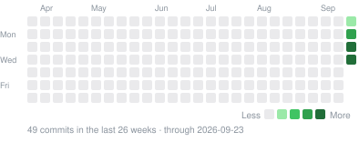
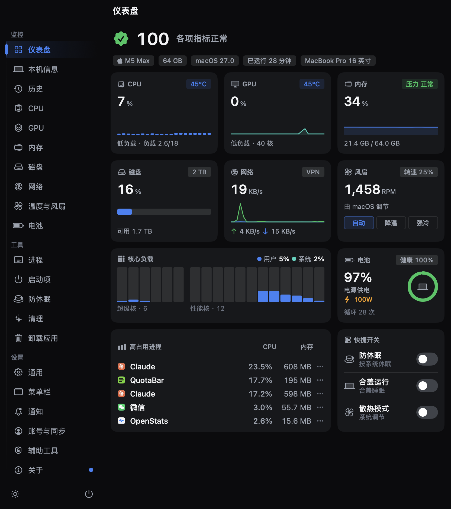
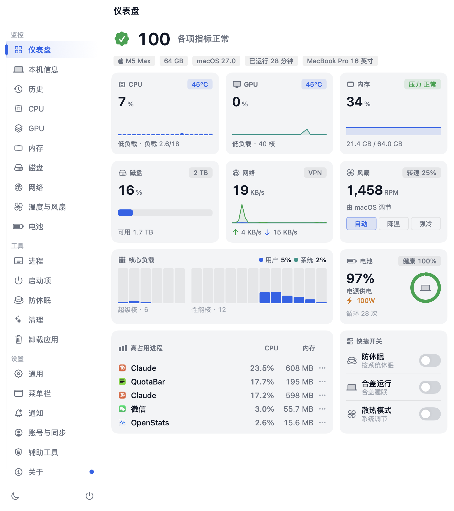
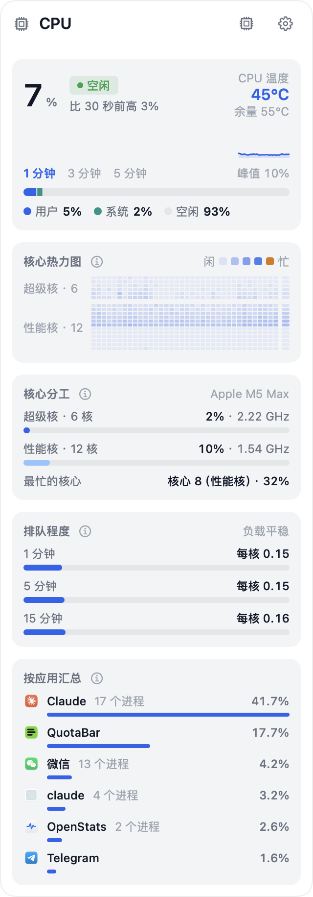
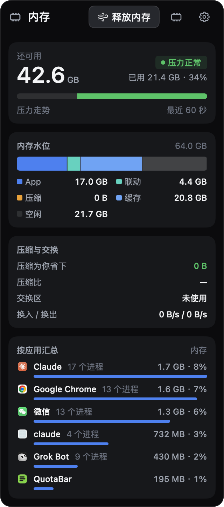
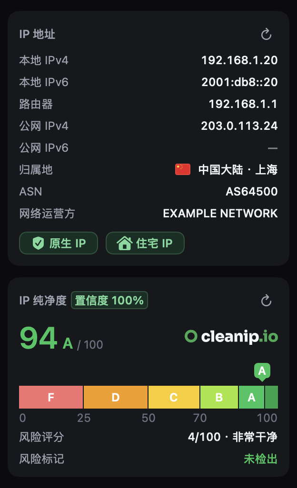
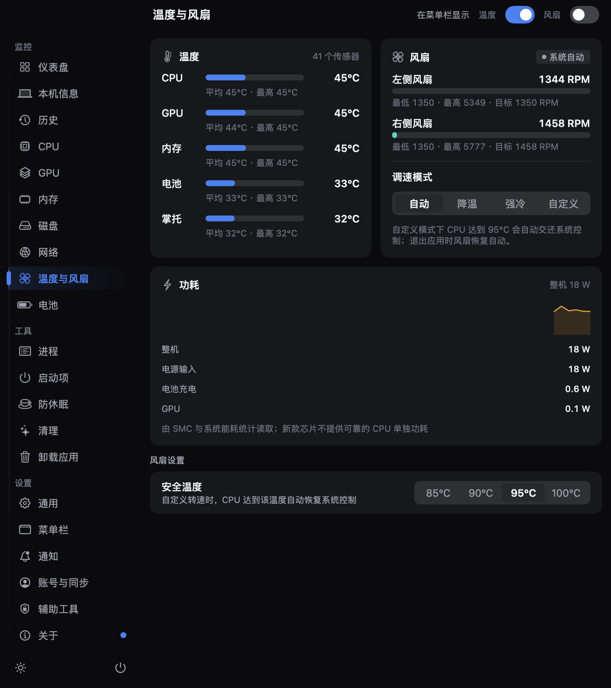
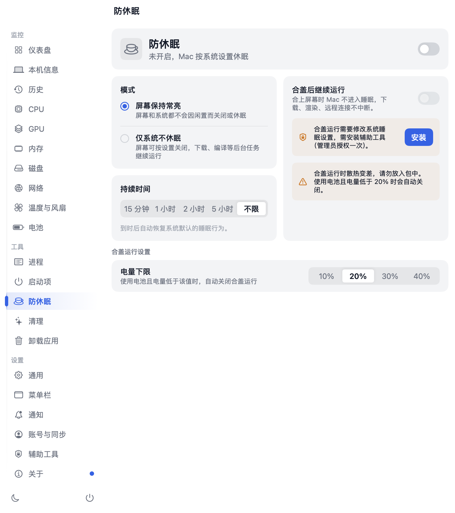
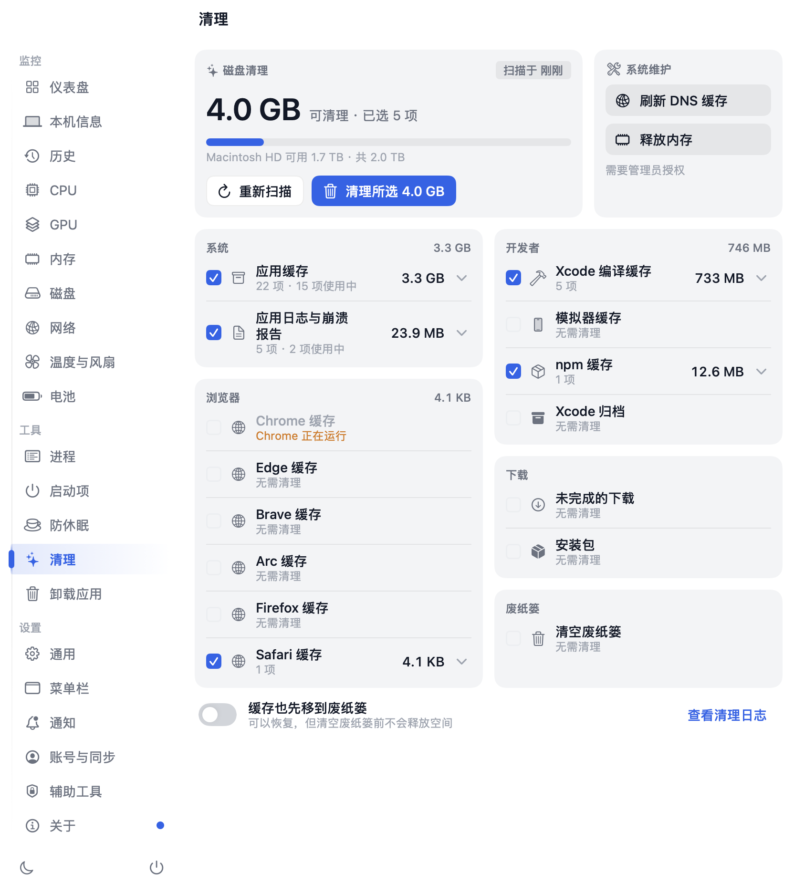

# XStats

**Mac 상태를 한눈에 확인하세요. 메뉴 막대에서 CPU, GPU, 메모리, 네트워크와 온도를 확인하고, 팬 제어, 잠자기 방지, 캐시 정리, 앱 제거, IP 평판 확인 기능을 사용할 수 있습니다.**

XStats는 CPU 코어별 사용량, GPU, 메모리 압력, 네트워크 속도, 디스크, 배터리, 온도와 팬 상태를 보여 주는 macOS 메뉴 막대 앱입니다.
팬 속도 조절, 덮개를 닫은 상태에서 실행 유지, 캐시 정리, 앱과 관련 파일 제거, 시작 항목 관리도 지원합니다.
네트워크 화면에서는 공인 IP가 VPN, 프록시, 데이터 센터 또는 악용 기록과 관련되어 있는지 확인할 수 있습니다. 로컬 Codex / Claude Code 로그로 모델별 토큰 사용량도 표시합니다.

모니터링 지표는 Mac 안에서만 처리하며 업로드하지 않습니다. XStats 계정 없이 자신의 WebDAV 서버로 설정을 수동 백업하고 복원할 수 있습니다. 업데이트 확인 시 중복을 제외한 설치 수와 버전 분포를 집계하기 위해 현재 버전과 무작위 설치 ID의 SHA-256을 전송하며, 원본 무작위 값은 키체인이 아닌 로컬 설정에만 저장합니다.
공인 IP 조회, 연결 테스트, 업데이트 확인 등의 네트워크 기능은 선택 사항입니다. Codex 사용 통계는 로컬에서 처리합니다.

[다운로드](https://github.com/ysicing/xstats/releases) · [변경 기록(중국어)](CHANGELOG.md) · [개발 안내(중국어)](DEVELOPMENT.md)

[简体中文](README.md) · [English](README.en.md) · [日本語](README.ja.md) · **한국어**

## 달력
「설정 → 메뉴 막대 → 달력」에서 독립 날짜 항목을 켤 수 있습니다. 월·연도 이동, 오늘로 돌아가기,
날짜별 상세 정보를 지원합니다. 양력은 항상 표시하며 음력, 요일, 명절, 중국 공휴일과 대체 근무일,
절기, 간지, 삼복, 전통 입매·출매 날짜는 개별적으로 켜고 끌 수 있습니다. 티베트력과 이슬람력은 기본적으로 꺼져 있습니다.
달력 설정은 WebDAV 백업에 포함됩니다.

[Tyme4Swift 1.5.0](https://github.com/6tail/tyme4swift)(MIT, [타사 라이선스](ThirdPartyNotices.md))로
기기에서 계산합니다. 탐색 범위는 1900–2100년이며 티베트력 데이터는 양력 1951-01-08부터 2051-02-11까지입니다.
중국 공휴일 데이터는 현재 2026년까지 제공하며 범위 밖에서는 안내를 표시합니다. 전통 입매·출매 날짜는 일기 예보가 아닙니다.

날짜를 클릭하면 길한 활동과 피할 활동, 납음, 충살, 당일 신, 열두 시진의 길흉, 건제십이신, 길신·흉신, 태신, 팽조백기, 이십팔수를 표시합니다. 월 달력으로 돌아가도 선택한 날짜는 유지됩니다.

## 설치

[GitHub Releases](https://github.com/ysicing/xstats/releases)에서 Apple Silicon 버전을 다운로드하세요.
아직 배포된 빌드가 없다면 [개발 안내(중국어)](DEVELOPMENT.md)를 참고하여 소스에서 빌드할 수 있습니다.

Apple Silicon Mac과 macOS 14(Sonoma) 이상이 필요합니다.
앱은 중국어 간체, 중국어 번체, 일본어, 한국어, 영어, 독일어, 스페인어, 프랑스어, 아랍어를 지원합니다.
기본적으로 시스템의 선호 언어를 자동 감지합니다. 설정의 언어 메뉴에서 검색하여 전환할 수 있으며, 아랍어는 오른쪽에서 왼쪽으로 배치됩니다.

XStats에는 아직 공식 웹사이트가 없습니다. 자동 업데이트와 기존 GeoIP 서비스는 유지하지만, 계정 로그인은 WebDAV 동기화로 대체했습니다.
업데이트 시 앱 식별자와 서명을 계속 검증하므로, OpenStats용 설치 패키지로 XStats를 교체할 수는 없습니다.

## 업데이트

최신 변경 사항과 미출시 기능은 [CHANGELOG.md(중국어)](CHANGELOG.md)를 확인하세요.
현재 설정 동기화는 WebDAV 수동 방식입니다. GitHub, Google, Apple 로그인과 기존 계정 백엔드는 제거되었습니다.

## 개발 활동

  

  <a href="https://star-history.com/#ysicing/xstats&Date">
    <picture>
      <source media="(prefers-color-scheme: dark)" srcset="https://api.star-history.com/svg?repos=ysicing/xstats&type=Date&theme=dark">
      
    </picture>
  </a>

## 화면 미리 보기

  
  

스크린샷의 앱 화면은 중국어로 표시되어 있습니다.

## 주요 기능

**메뉴 막대**

- 두 줄 텍스트, 한 줄 텍스트, 아이콘, 링, 원형 차트, 기록 막대, 배터리 막대, 상태 점 등 8가지 스타일을 제공합니다. 지표별로 다른 스타일을 지정할 수도 있습니다.
- 네트워크 속도는 업로드를 초록색, 다운로드를 파란색으로 표시하며 KB/s, MB/s, GB/s 단위를 항상 보여 줍니다.
- 고정 폭 숫자를 사용해 값이 바뀔 때 표시 폭이 흔들리는 현상을 줄입니다. 마우스를 올리면 전체 값을 볼 수 있습니다.

**상세 팝오버**

지표를 클릭하면 세부 정보가 열립니다. 표시할 영역은 설정에서 선택하고 Esc 키로 닫을 수 있습니다.

- **CPU**: 사용량, 온도, 최근 1/3/5분 추이, 코어별 부하와 히트맵, 주파수, 평균 부하, 앱별 사용량.
- **메모리**: 사용 가능한 용량, 메모리 압력, 압축 메모리, 스왑 읽기·쓰기, 앱별 사용량.
- **네트워크**: 트래픽 기록, 최근 60회 연결 테스트, 인터페이스, Wi-Fi, VPN/프록시, 로컬·공인 IPv4/IPv6, 국가, ASN, IP 평판, DNS 관리, 프로세스별 트래픽.
- **디스크**: 사용 중·정리 가능·사용 가능 용량, 읽기·쓰기 속도와 60초 추이, SSD 상태, 접근량이 많은 앱.
- **GPU·온도·팬**: 사용 기록, 센서 그룹별 온도, 팬 회전수와 제어 모드.
- **배터리**: 잔량, 남은 사용 시간·충전 완료 시간, 어댑터 출력, 온도, 24시간 추이, 소비 전력, 상태, 충전 사이클, 연결된 Bluetooth 기기의 배터리. 배터리가 없는 Mac에서는 Bluetooth 기기만 표시합니다.

  
  
  

**IP 평판과 네트워크 테스트**

CleanIP.io 점수, F~A+ 등급, VPN·프록시·Tor·데이터 센터·악용 기록 등의 위험 표시를 제공합니다.
IPv4와 IPv6를 따로 확인하며 결과는 최대 7일 동안 로컬에 캐시합니다. IP가 바뀌거나 새로 고침을 누르면 다시 조회합니다.
속도 측정, 지역별 노드 연결 확인, Globalping 공개 프로브를 통한 지연 시간·패킷 손실 측정도 지원합니다.
Globalping 측정 결과는 공개되므로 직접 지정한 대상을 확인하는 용도로 사용하세요. 속도 측정에는 시간과 데이터 사용량 제한이 있습니다.

  
  

**메인 창**

사이드바에서 대시보드, 시스템 정보, 기록, 각종 지표, 프로세스, 시작 항목, 잠자기 방지, 정리, 앱 제거, 설정으로 이동합니다.
창 크기를 조절할 수 있으며 라이트·다크 모드를 직접 선택하거나 시스템 설정을 따를 수 있습니다.

**AI 프로세스 설명**

프로세스를 오른쪽 클릭하면 시스템 내장 모델이 용도, 사용량이 정상인지, 종료해도 되는지 설명합니다.
Apple Intelligence의 기기 내 모델만 사용합니다. 사용할 수 없으면 이유를 표시하며 다른 서비스로 전환하지 않습니다. 프로세스를 종료하기 전에 설명을 확인하세요.

  
  

## 팬 제어와 잠자기 방지

| 모드 | 동작 |
|---|---|
| 자동 | macOS에 제어를 돌려줍니다 |
| 냉각 | 최소~최대 회전수 범위의 60%로 고정합니다 |
| 최대 냉각 | 최대 회전수로 작동합니다 |
| 사용자 지정 | 슬라이더로 회전수를 지정합니다 |

사용자 지정 모드에서 CPU가 안전 온도(기본 95°C)에 도달하면 시스템 제어로 돌아갑니다.
XStats를 종료하거나 앱이 비정상 종료되면 팬이 자동 모드로 복원됩니다. 덮개를 닫은 상태에서 실행 유지는 배터리가 설정한 하한보다 낮아지면 해제됩니다.

이 기능은 SMAppService로 등록한 권한 있는 보조 프로그램을 사용합니다. 처음 사용할 때 시스템 설정의 로그인 항목에서 허용해야 합니다.
보조 프로그램은 호출 앱의 서명을 확인하고 팬 제어, 잠자기 설정, DNS 캐시 비우기, 메모리 확보 등 정해진 작업만 수행합니다.
임의의 명령은 실행하지 않습니다. 연결이 끊기거나 비정상 종료 후 다시 시작하면 팬과 잠자기 설정을 복원합니다.

## 정리

- **대상**: 앱·브라우저 캐시, 로그, 충돌 보고서, Xcode·시뮬레이터·npm·Yarn·pnpm·Bun·Go·Rust·uv 캐시, Xcode 아카이브, 미완료 다운로드, 설치 파일, 휴지통.
- **삭제 전 확인**: 유형별 용량과 개별 파일을 표시하고 실행 전에 다시 확인합니다. 개발 도구 캐시는 내부 디렉터리를 직접 삭제하지 않고 각 도구의 명령으로 정리합니다. 처음에는 선택되지 않으며 이후 이 Mac의 선택 상태를 기억합니다. 휴지통 설정은 디렉터리 기반 캐시에만 적용됩니다.
- **보호**: 허용된 디렉터리만 처리합니다. 키체인, 비밀번호 관리자, VPN, 쿠키, 기록 등을 보호하고 실행 중인 앱의 캐시는 건너뜁니다. 삭제 직전에 각 항목을 다시 검사합니다.
- **기록**: 작업 로그는 ~/Library/Logs/XStats/cleanup.log에 저장합니다.
- **유지 관리**: DNS 캐시 비우기와 메모리 확보를 지원합니다. 보조 프로그램이 없으면 관리자 인증을 요청합니다.

## 앱 제거와 시작 항목

- 앱을 선택하거나 끌어다 놓으면 관련 데이터, 캐시, 환경설정, 컨테이너, 로그, 시작 항목을 찾습니다. 항목별로 제외할 수 있으며 확인 후 앱과 함께 휴지통으로 옮깁니다. 시스템·Apple 앱은 제외하고, 실행 중인 앱은 먼저 종료하도록 안내합니다.
- 사용자 및 시스템의 LaunchAgents/LaunchDaemons와 실행 상태를 표시합니다. 현재 사용자의 시작 항목은 파일을 삭제하지 않고 비활성화·재활성화할 수 있습니다. 다른 항목은 읽기 전용입니다.

## 데이터와 개인정보

지표는 로컬 커널, IOKit, SMC에서 읽으며 설정은 앱의 UserDefaults에 저장합니다. 모니터링 지표, 기록, 하드웨어 일련번호와 프로세스 목록은 업로드하지 않습니다.
AI 사용량 및 한도는 기본적으로 꺼져 있습니다. 켜면 로컬 Codex / Claude Code 로그로 모델별 토큰, 캐시 적중률, 일별 추이를 집계하고, CLI 로그인 정보를 읽기 전용으로 확인하여 각 서비스에서 5시간 및 주간 사용 한도를 직접 조회합니다. 기본값은 최근 1년 활동 히트맵입니다. SQLite에 읽기 위치와 통계를 저장하여 재시작 후에도 증분을 읽습니다. 일별·주별·누적 보기 모두 최근 1년을 표시합니다. 로그인 정보는 XStats 설정이나 통계 DB에 저장하지 않으며 세션 로그를 한도 조회 요청에 보내지 않습니다.
두 소스가 모두 켜져 있고 하나라도 할당량 데이터가 있으면 메뉴 막대의 AI 항목에 Codex와 Claude를 각각 표시합니다. 데이터가 없는 소스는 대시로 표시하고 재설정 시각은 툴팁에 표시합니다.
로컬 Codex 또는 Claude Code 로그인으로 할당량을 가져올 수 없다면 AI 사용량 및 한도 설정에서 각 소스에 별도의 Sub2API HTTPS 주소, 관리자 이메일과 비밀번호, 계정 ID를 등록할 수 있습니다. 각 소스의 자동 조회가 실패할 때만 해당 예비 설정을 사용하고 계정 플랫폼도 확인합니다. 백그라운드 요청은 `force=false`로 캐시된 할당량을 읽어 능동 검사를 실행하지 않습니다. 관리자 비밀번호는 소스별로 이 Mac의 키체인에 저장하고 연결 설정은 WebDAV 백업에 포함하지 않습니다. 로그인할 때는 지정한 Sub2API 서버로 관리자 정보를 전송합니다.
Sub2API가 Fable 수치를 반환하지 않으면 페이지에 할당량 데이터가 없다고 표시하며, 누락된 값을 사용량 0%로 취급하지 않습니다.
공인 IP는 Cloudflare(실패 시 ipify), IP 평판은 cleanip.io에 직접 조회합니다. 연결 테스트는 선택한 대상으로 ICMP ping을 보냅니다. 업데이트 확인은 현재 버전과 무작위 설치 ID의 SHA-256을 보내고 버전 정보를 읽습니다. 중국 지역은 `x-stats.china.12306.work`, 그 외 지역은 `xstats-apps.12306.work`를 우선 사용하며, 실패한 경우에만 다른 엔드포인트로 순차 전환하고 첫 성공 후 중지합니다. 서버에는 해당 해시, 현재 버전, 최초·최근 확인 시각과 확인 횟수만 저장하며, 하드웨어 일련번호를 저장하지 않고 요청 IP도 영구 저장하지 않습니다(1분 동안의 메모리 내 속도 제한에만 사용). 자동 업데이트 확인을 끄면 자동 요청도 중지됩니다.
이 기능들은 설정에서 끌 수 있습니다. Apple Intelligence 프로세스 설명은 기기 안에서 처리됩니다.

### WebDAV 설정 동기화

1. 자신의 WebDAV 서버에 디렉터리를 만든 다음, 앱의 **Settings → Settings Sync**(영어 UI)를 엽니다.
2. 기존 디렉터리의 HTTPS URL, 사용자 이름, 비밀번호 또는 앱 전용 비밀번호를 저장합니다. Basic 인증과 유효한 TLS 인증서가 필요합니다. 리다이렉트를 따르지 않으므로 최종 디렉터리 URL을 입력하세요.
3. **Upload Local Settings**에서 확인하면 xstats-settings.json을 만들거나 덮어씁니다. 다른 Mac의 변경 사항과 병합하지 않습니다.
4. 다른 Mac에서도 같은 연결 정보를 설정한 다음 **Download and Apply**를 선택합니다. 검증 후 **Apply and Overwrite**를 눌러 해당 로컬 설정을 바꿉니다.

동기화는 수동으로만 실행합니다. 앱 시작, 잠자기 해제, 설정 변경 시 자동으로 전송하지 않습니다.
비밀번호는 각 Mac의 키체인에 저장하며, 모니터링 데이터·기록·WebDAV 연결 정보는 백업에 포함하지 않습니다.
JSON 파일 자체는 추가 암호화하지 않으므로 비공개 디렉터리를 사용하세요.
처음에는 업로드가 필요합니다. 1 MB를 넘는 파일, 잘못된 형식, 지원하지 않는 버전은 거부하며 로컬 설정을 변경하지 않습니다.
기존 계정 로그인과 백엔드는 제거되었습니다. iCloud 동기화는 지원하지 않습니다.

## 개발자용

2차 개발, 빌드, 테스트, 버전, 서명·배포는
[DEVELOPMENT.md](DEVELOPMENT.md)를 참고하세요. 자세한 구조는
[ARCHITECTURE.md(영어)](ARCHITECTURE.md)에 있습니다.

## 감사의 글

| 프로젝트 | 작성자 | 라이선스 | 사용하거나 참고한 내용 |
|---|---|---|---|
| [OpenStats](https://github.com/gentpan/OpenStats) | GiantAccel, LLC | MIT | XStats의 기반이 된 프로젝트. 오픈소스 기여에 감사드립니다 |
| [Stats](https://github.com/exelban/stats) | Serhiy Mytrovtsiy | MIT | SMC 통신, Apple Silicon 팬 제어, 메뉴 막대 표시 |
| [Mole](https://github.com/tw93/Mole) | tw93 | GPL-3.0 | 정리·보호 대상에 대한 아이디어. 정리 기능은 독립적인 Swift 구현이며 Mole 코드를 포함하지 않습니다 |
| [QuotaBar](https://github.com/gentpan/quotabar) | GiantAccel, LLC | MIT | README 구성, 변경 기록 동기화, 활동 그래프 |
| [AI Usage](https://github.com/burakgon/ai-usage-menubar) / [OpenUsage](https://github.com/robinebers/openusage) | Burak Gon / Robin Ebers | MIT | AI Provider 계약과 테스트 사례 |
| [usage-bar](https://github.com/methol-dev/usage-bar) | Krystian | BSD-2-Clause | Provider 상태와 이전 값 유지 설계 참고 |

자세한 내용은 [ThirdPartyNotices.md](ThirdPartyNotices.md)를 참고하세요.
XStats는 독립적인 서드파티 앱이며 Apple이나 본문에 언급된 다른 회사가 승인하거나 후원하는 제품이 아닙니다.

## 라이선스

XStats의 새 코드와 수정 부분에는 **AGPL-3.0-or-later**를 적용합니다. [LICENSE](LICENSE)와 [적용 범위 및 기여 요건(중국어)](LICENSING.md)을 참고하세요.

기존 OpenStats 코드는 원래의 [MIT 라이선스와 저작권 고지](LICENSES/OpenStats-MIT.txt)를 유지합니다. 다른 서드파티 라이선스는 [ThirdPartyNotices.md](ThirdPartyNotices.md)에 명시되어 있습니다.
