<div align="center">

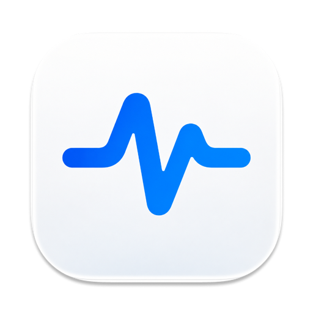

# XStats

**Mac 메뉴 막대를 위한 시스템 모니터링과 일상 도구.**

CPU, 메모리, 네트워크, 온도를 한눈에 보고, 세부 화면에서 추이와 앱 사용량을 확인하세요. AI 사용량, 달력, 팬 제어 등의 도구는 필요할 때 켤 수 있습니다.

[](https://github.com/ysicing/xstats/releases)
[](https://github.com/ysicing/xstats/actions/workflows/ci.yml)
[](https://github.com/ysicing/xstats/releases)
[](LICENSE)
[](https://twitter.com/YsiCing)

[최신 버전 다운로드](https://github.com/ysicing/xstats/releases) · [기능](#기능) · [설치](#설치) · [데이터와 개인정보](#데이터와-개인정보) · [변경 기록(중국어)](CHANGELOG.md)

[简体中文](README.md) · [English](README.en.md) · [日本語](README.ja.md) · **한국어**


</div>

<p align="center">
  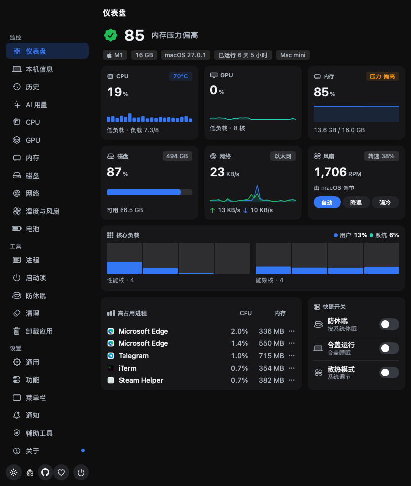
  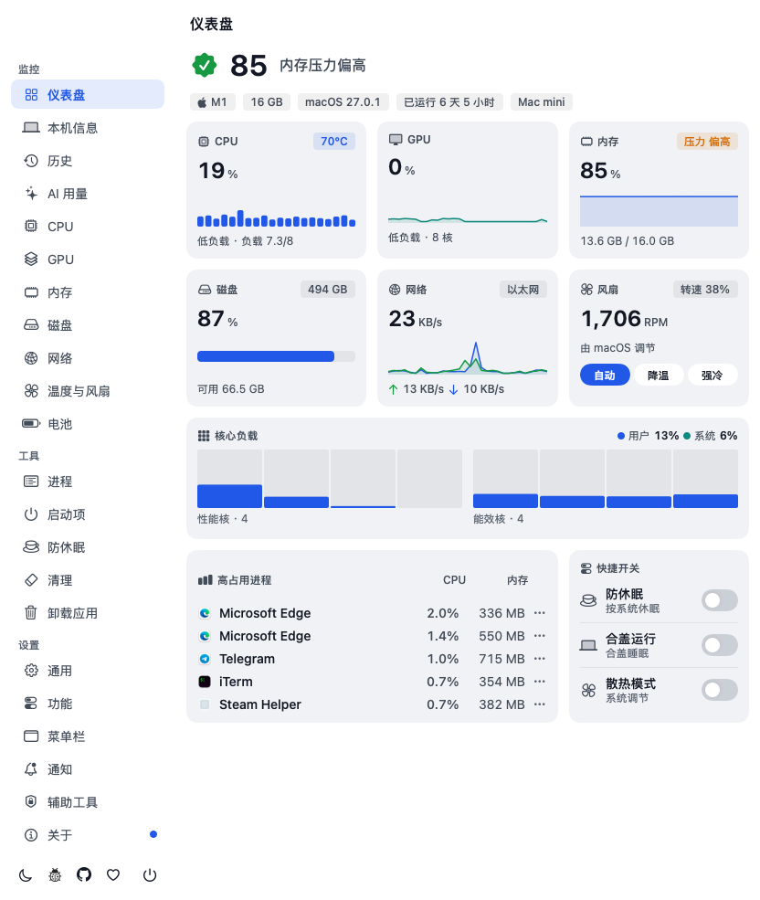
</p>

## 기능

XStats는 Swift, AppKit, SwiftUI로 만든 무료 오픈소스 네이티브 앱입니다. 계정 등록이 필요 없습니다.

### 메뉴 막대 표시

지표를 **개별 표시**, **통합 모드**, **아이콘 하나만** 중에서 선택할 수 있습니다. 항목, 순서, 스타일(텍스트, 아이콘, 링, 진행 막대, 기록 그래프)을 모두 바꿀 수 있습니다.

통합 모드의 개요에서 여러 지표를 한눈에 확인하고 개별 상세 정보를 열 수 있습니다.

<p align="center">
  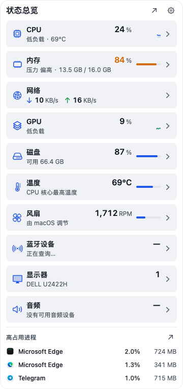
  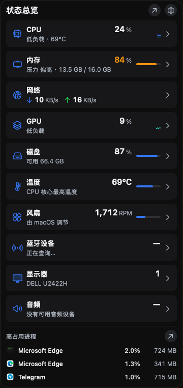
</p>

### 기능 활성화와 메뉴 막대 표시

설정 → 기능에서 기본 기능과 선택 기능을 별도로 관리합니다.

- **기본 모니터링**: CPU, GPU, 메모리, 디스크, 네트워크, 온도와 팬, 배터리를 각각 켜거나 끌 수 있습니다. 끄면 수집, 관련 알림, 새 기록 저장을 중단하고 기존 기록은 유지합니다. 시스템 위젯은 독립적으로 갱신됩니다.
- **메뉴 막대 표시**: 기본 모니터링, AI 사용량, 오디오에서 메뉴 막대에 표시를 선택하면 해당 기능도 켜집니다. 선택을 해제해도 기능은 켜진 상태로 유지됩니다. AI 사용량과 오디오에도 별도 표시 옵션이 있습니다.
- **디스플레이 매개변수 제어**: 밝기, 대비, 음량의 읽기와 조절을 제어합니다. 꺼도 디스플레이 정보는 확인할 수 있으며 정보만 표시하는 메뉴 막대 항목도 별도로 설정할 수 있습니다.

<p align="center">
  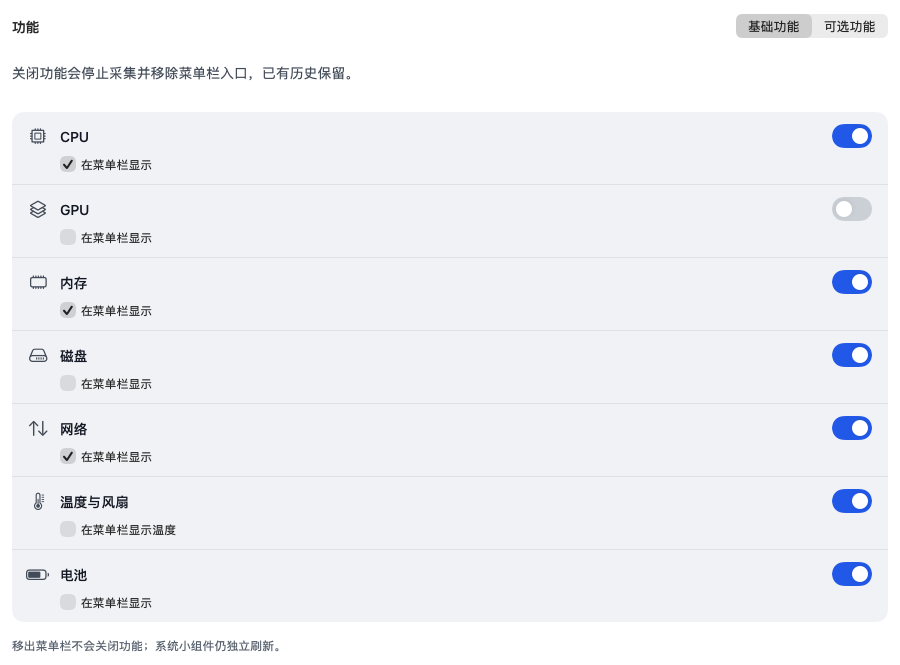
  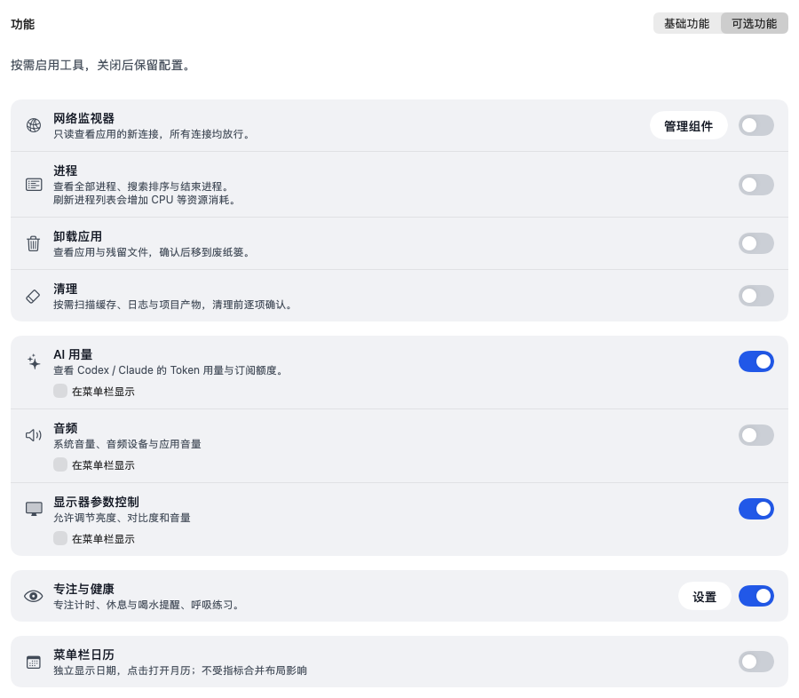
</p>

### 시스템 모니터링

| 모듈 | 내용 |
|---|---|
| **CPU** | 사용자 / 시스템 / 유휴 사용률, 코어별 및 코어 그룹 부하, 평균 부하, 주파수와 온도, 열 상태 경고 |
| **GPU** | 그래픽 사용률, 코어 수, 온도와 소비 전력 |
| **메모리** | 메모리 압력, 앱 / 압축 / 캐시 구성, 스왑 공간과 스왑 속도 |
| **디스크** | 용량, 읽기/쓰기 속도, 앱별 I/O 순위, SMART 상태 |
| **네트워크** | 업로드/다운로드 속도, 네트워크 인터페이스와 연결 개요 |
| **배터리와 Bluetooth** | 잔량, 전원, 건강 상태, 충전 사이클 수, Bluetooth 기기 잔량 |
| **온도와 팬** | 온도 센서, 팬 회전수, 소비 전력 |
| **디스플레이** | 해상도, 스케일링, 주사율. DDC/CI를 지원하는 외부 디스플레이의 밝기, 대비, 음량 조절 |
| **시스템 정보** | Mac 및 시스템 식별 정보. Apple Intelligence 옆 상세 아이콘에서 기능 설정 상태, 온디바이스 모델 가용성 및 저장 공간 확인 |

주파수, 온도, 소비 전력 등의 수치는 기종과 macOS가 제공하는 경우에 표시됩니다.

<p align="center">
  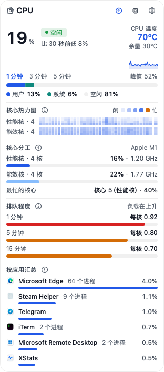
  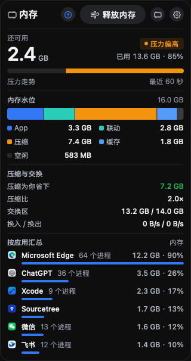
</p>

### 네트워크 모니터

**macOS 15 이상에서 선택적으로 사용하며 기본적으로 꺼져 있습니다.** 관찰 중 새로 발생한 연결을 앱, 프로세스, 도메인, 국가 또는 지역별로 표시하고 검색, 활성 연결 필터, 일시 정지와 재개를 지원합니다.

- **읽기 전용**: 모든 통신을 허용하고 통신 내용을 읽지 않으며 연결 이력도 저장하지 않습니다.
- **필요할 때만 동작**: 페이지가 보이고 일시 정지하지 않은 동안만 읽으며 메모리에 최대 512개 기록을 유지합니다. 관찰을 시작하기 전부터 존재하던 모든 연결을 나열하지는 않습니다.
- **세계 지도**: 처음 사용할 때 공개 IP 지리 데이터베이스를 내려받고 이후에는 오프라인으로 조회합니다. 위치는 국가나 지역의 대표 지점이며 기기의 정확한 위치가 아닙니다.

처음 사용할 때 설정 → 기능 → 선택 기능에서 네트워크 모니터를 켜고 구성요소 설치 안내를 따른 뒤 macOS에서 시스템 확장과 네트워크 필터를 허용하세요. 설치에는 관리자 계정이 필요합니다. 구성요소 관리에서 독립 업데이트를 확인하거나 구성요소를 제거할 수 있습니다.

미리 보기 구성요소를 사용했다면 먼저 본체 앱을 업데이트하고 구성요소 관리에서 이전 구성요소를 제거하세요. macOS가 재시동을 요구하면 완료한 뒤 다시 켜서 현재 업데이트 소스로 전환합니다.

<p align="center">
  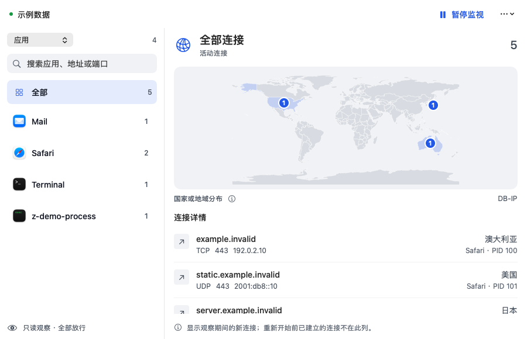
  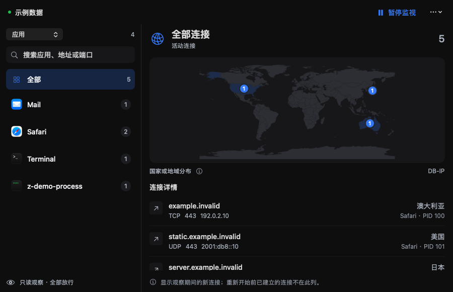
</p>

<p align="center">
  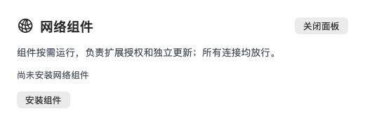
  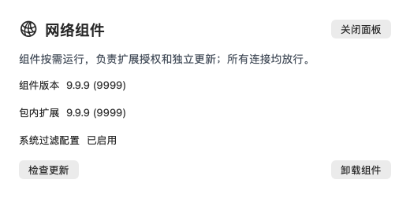
</p>

연결, 주소, 국가 또는 지역, 구성요소 버전 정보는 데모 데이터입니다.

### AI 사용량

메뉴 막대에서 Codex / Claude Code 사용량을 확인할 수 있습니다.

- **토큰 통계**: 오늘은 시간별, 최근 7일 / 30일은 일별로 집계하며 연간 활동 히트맵도 제공합니다.
- **구독 한도**: 사용 / 남은 비율, 초기화 시각, 요금제 정보. Sub2API를 예비 소스로 설정할 수 있습니다.
- **추정 비용**: 공개 API 기본 단가로 미국 달러 / 중국 위안 기준으로 계산하며 구독 청구액이 아닙니다.

로컬 통계는 CLI 세션 로그를 읽으며, 한도 조회에는 해당 CLI 로그인이 필요합니다.

### 도구

| 도구 | 설명 |
|---|---|
| **팬 제어** | 지원되는 기기에서 자동 / 수동 제어 전환 |
| **잠자기 방지** | 시스템이나 화면을 깨어 있게 유지하며 덮개를 닫은 상태 동작도 설정 가능 |
| **정리와 앱 제거** | 캐시, 빌드 산출물, 앱 잔여 파일을 미리 확인한 뒤 제거 |
| **시작 항목** | 로그인 항목과 백그라운드 시작 항목 관리 |
| **네트워크 진단** | 속도 테스트, DNS 조회, 외부 연결 경로 검사, 공인 IP 위치 및 순도, 연결 탐색 |
| **메뉴 막대 달력** | 음력, 중국 공휴일과 대체 근무일, 역서, 캘린더 일정과 미리 알림 |
| **오디오** | 시스템 음량과 입출력 기기 전환. macOS 14.4 이상에서 앱별 음량과 출력 조절(기기에서만 처리) |
| **집중과 눈 휴식** | 뽀모도로, 여러 디스플레이의 휴식 화면, 미니 HUD. 독립적인 눈 휴식 알림과 로컬 활동 통계 |
| **프로세스 관리** | 검색, 정렬, 앱별 그룹화, 프로세스 종료 |

집중을 바로 시작, 일시 정지하거나 종료할 수 있습니다. 휴식 후 다음 라운드를 직접 시작하거나 설정에서 자동 시작을 켤 수 있습니다. 네 라운드마다 긴 휴식이 이어집니다.

휴식 소리는 가벼운 빗소리, 시냇물, 바람, 핑크 노이즈, 화이트 노이즈를 기기에서 합성하며 5초간 미리 들을 수 있습니다. 음원 다운로드나 마이크 접근은 없습니다.

사용자 오디오에서 최대 50 MB의 로컬 오디오를 가져와 휴식 중 반복 재생할 수 있습니다. 앱이 사본을 보관하므로 원본을 옮겨도 사용할 수 있습니다. 오디오와 파일 정보는 설정 백업에 포함하지 않습니다. 소리를 끄면 미리 듣기 버튼이 숨겨집니다.

눈 휴식 알림은 기본적으로 꺼져 있으며 “집중과 눈 휴식” 설정에서 켤 수 있습니다. 뽀모도로 없이도 작동하고 가까운 라운드 사이 휴식과 합칩니다. 라운드 사이 휴식은 집중 후의 휴식이며, 눈 휴식은 언제든 시작하는 짧은 휴식으로 시간을 따로 설정합니다. 눈 휴식을 시작하면 집중이 일시 정지되며 재개는 직접 선택합니다. 집중·휴식 기록은 이 Mac에 90일간 보관되며 통계에서 지울 수 있습니다. 설정 백업에는 활동 기록을 포함하지 않습니다. 휴식 소리는 5초간 미리 들을 수 있고, 소리를 바꾸거나 설정을 닫으면 멈춥니다.

설정 → 기능 → 선택 기능에서 필요한 도구를 켤 수 있으며 기존 설정은 유지됩니다. 앱 제거 기능은 새로 설치하면 기본적으로 꺼지고 이전 버전에서 업데이트하면 켜진 상태로 유지됩니다. 팬 제어와 덮개를 닫은 상태의 잠자기 방지 같은 권한이 필요한 작업은 앱에서 보조 도구를 설치하고 허용해야 합니다.

앱 제거 기능은 앱과 보조 구성 요소의 잔여 파일, 샌드박스 컨테이너와 주요 앱의 데이터 폴더를 찾습니다. 공유 가능성이 있는 데이터는 기본적으로 선택하지 않으며 공급업체의 공유 폴더는 유지합니다. 확인한 항목은 휴지통으로 옮기고 실패한 항목은 재시도할 수 있도록 남깁니다. 앱 본체를 제거한 뒤에도 잔여 파일을 정리할 수 있습니다.

<details>
<summary>더 많은 스크린샷</summary>

네트워크 연결, AI 사용량과 한도, 기록, 오디오, 디스플레이, 일정 화면은 데모 데이터입니다. 기본 시스템 모니터링 화면에는 이 Mac의 읽기 전용 측정값이 포함됩니다. 하드웨어 기능은 기종에 따라 다릅니다.

<p align="center">
  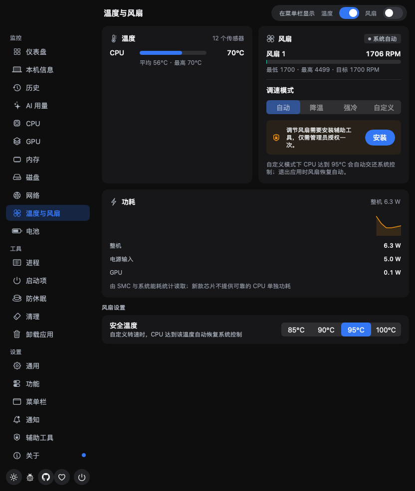
  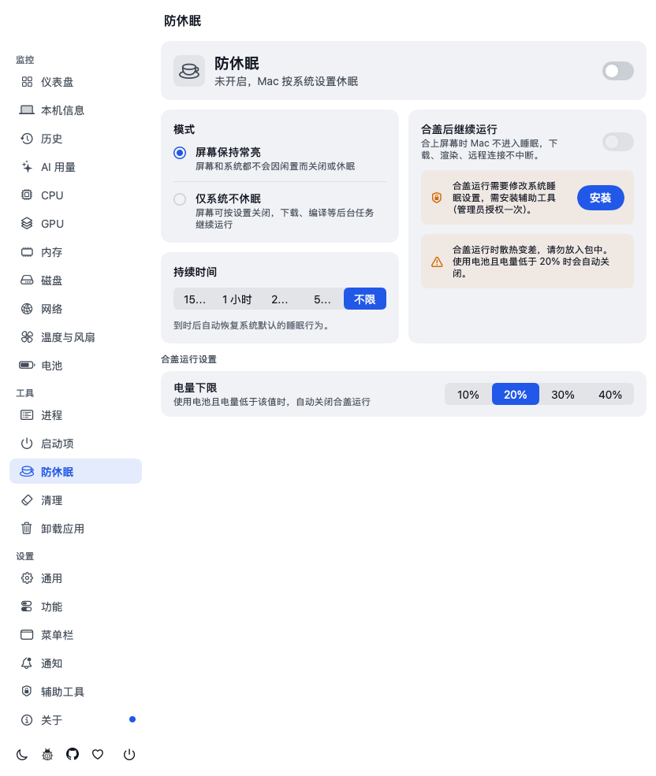
</p>
<p align="center">
  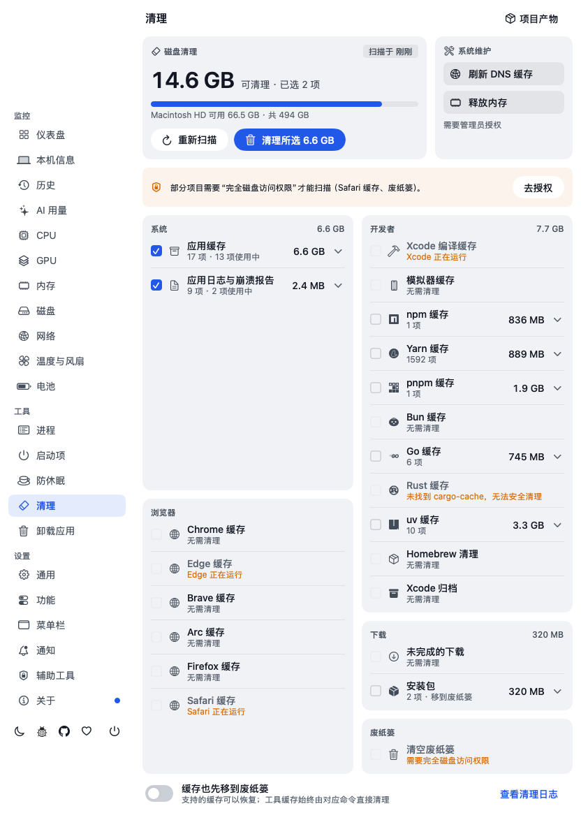
  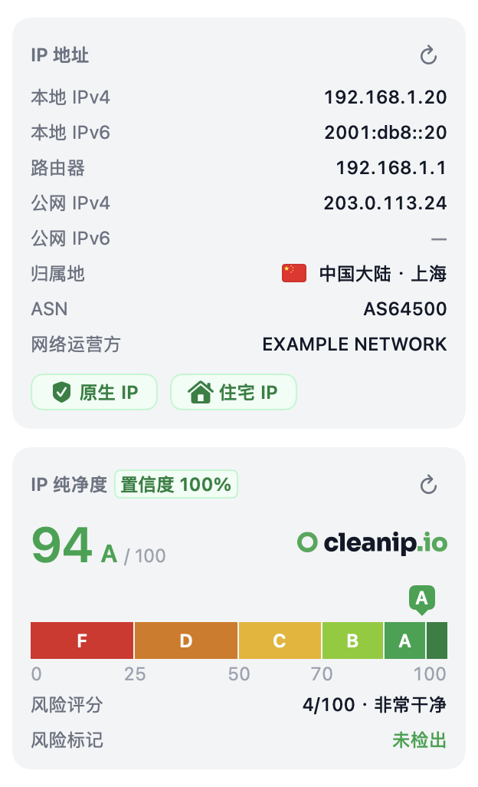
</p>
<p align="center">
  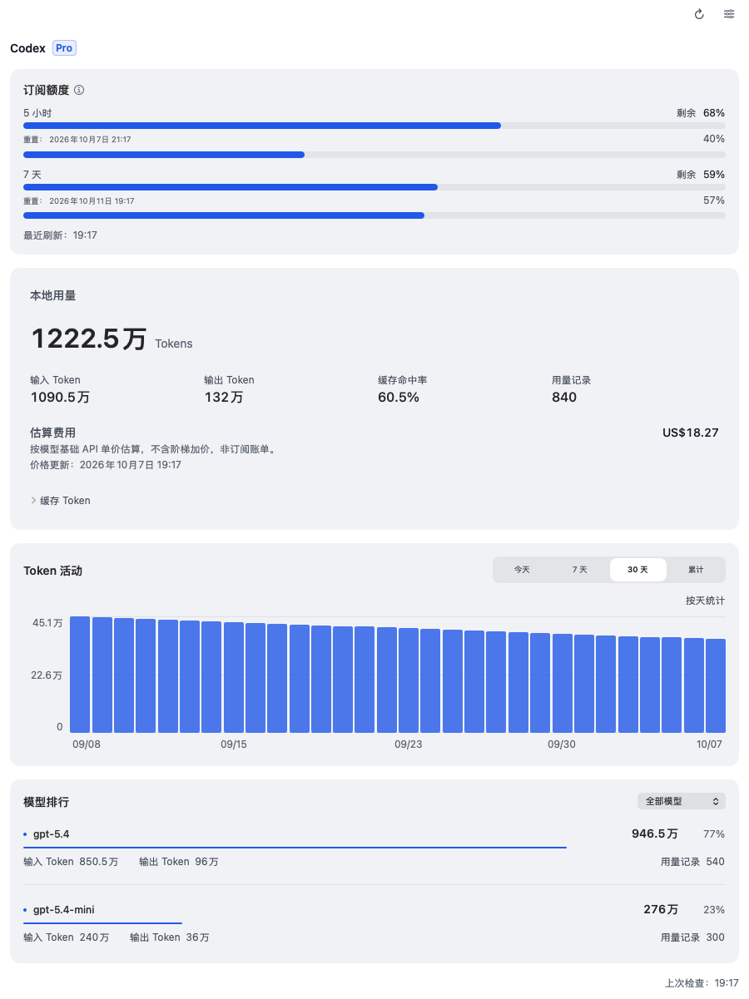
  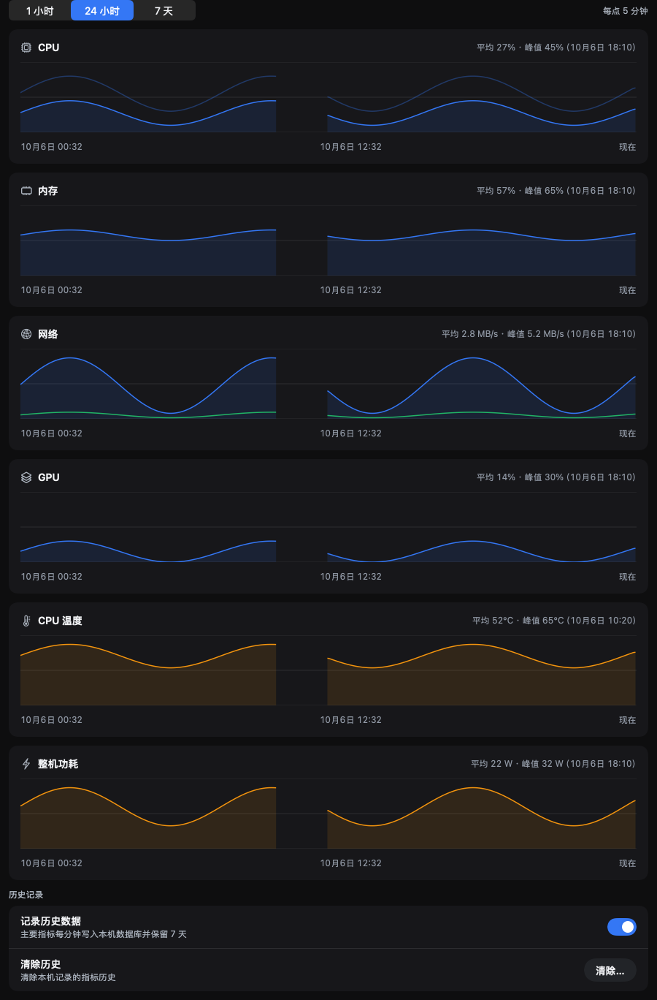
</p>
<p align="center">
  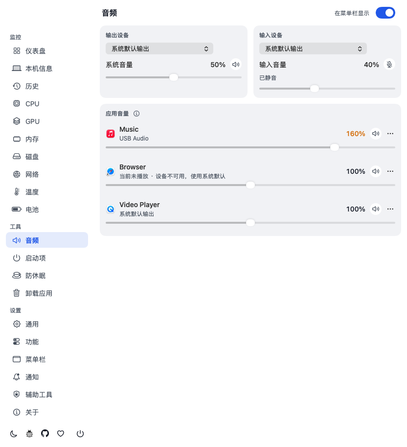
  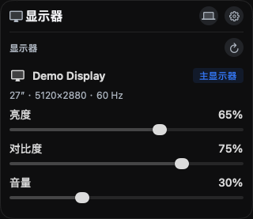
</p>
<p align="center">
  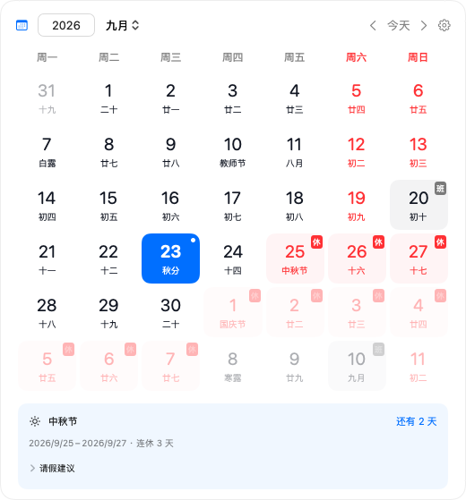
  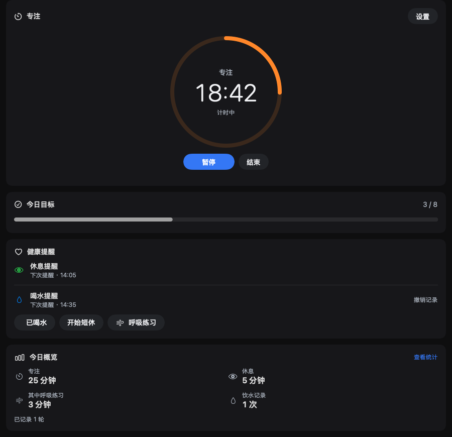
</p>

</details>

### 연동

- **데스크톱 위젯**: 시스템 개요, 뽀모도로, AI 한도, 달력과 월 달력, ‘내일 출근?’, IP 순도, 공인 IP.
- **언어**: 简体中文, 繁體中文, English, 日本語, 한국어, Deutsch, Español, Français, العربية.
- **딥 링크**: 런처, 단축어 또는 터미널에서 `xstats://`로 자주 쓰는 화면을 열 수 있습니다. 꺼진 모듈은 설정 페이지로 이동하며 자동으로 켜지지 않습니다.

```bash
open 'xstats://open/connections'   # 네트워크 모니터 열기
open 'xstats://panel/cpu'          # CPU 팝오버 표시
```

전체 경로와 동작은 [딥 링크 프로토콜](docs/DEVELOPMENT.md#xstats-深链)을 참고하세요.

## 설치

**Apple Silicon Mac과 macOS 14 이상**이 필요합니다.

```bash
brew tap ysicing/tap
brew trust ysicing/tap
brew install --cask xstats
```

또는 [GitHub Releases](https://github.com/ysicing/xstats/releases)에서 DMG를 받아 XStats를 ‘응용 프로그램’으로 드래그하세요. 앱이 업데이트를 확인하며, 설치 여부는 사용자가 선택합니다.

## 데이터와 개인정보

모니터링 데이터, 로컬 기록, AI 토큰 통계는 기기에서 처리하며 XStats 업데이트 서비스에 업로드하지 않습니다. 다음 기능은 외부 서비스에 연결하며, 끄거나 필요할 때 사용할 수 있습니다.

- **업데이트 확인**: 본체 앱과 독립 네트워크 구성요소가 각각의 버전과 설치 ID의 해시를 보내 업데이트 정보를 가져옵니다.
- **AI 한도 조회**: 로컬 CLI 로그인으로 제공자에 조회하며, 예비 소스를 설정하면 지정한 서버에 연결합니다.
- **비용 추정**: 공개 모델 단가와 참고 환율을 필요할 때 가져오며, 세션 로그나 토큰 통계는 보내지 않습니다.
- **네트워크 모니터**: 구성요소와 공개 지리 데이터베이스를 다운로드할 때 네트워크에 연결하며 연결 기록과 대상 IP는 업로드하지 않습니다.
- **네트워크 진단**: 공인 IP, 위치, 속도 테스트, DNS, 연결 탐색, 글로벌 프로브는 해당 서비스에 연결합니다. 글로벌 프로브의 대상과 결과는 다른 사람이 조회할 수 있습니다.

자세한 내용은 [개인정보 처리방침(영어)](Packages/XStatsKit/Sources/XStatsUI/Resources/Legal/Privacy.en.md)과 [서비스 약관(영어)](Packages/XStatsKit/Sources/XStatsUI/Resources/Legal/Terms.en.md)을 확인하세요.

## 빌드와 기여

Xcode 26+, Go 1.25+, [Go Task](https://taskfile.dev/), [XcodeGen](https://github.com/yonaskolb/XcodeGen)이 필요합니다.

```bash
task test
task build BUMP=0 INSTALL=0
```

Issue와 Pull Request를 환영합니다. 환경 설정과 릴리스 과정은 [DEVELOPMENT.md(중국어)](docs/DEVELOPMENT.md), 모듈 경계와 구현 제약은 [ARCHITECTURE.md(영어)](docs/ARCHITECTURE.md)을 참고하세요.

## 변경 기록

최신 변경 사항은 [CHANGELOG.md(중국어)](CHANGELOG.md)를 확인하세요.

## 감사와 라이선스

XStats는 [OpenStats](https://github.com/gentpan/OpenStats)를 기반으로 개발되었습니다. 원 프로젝트와 [ThirdPartyNotices.md](ThirdPartyNotices.md)에 명시한 다른 오픈 소스 프로젝트에 감사드립니다. XStats는 Apple 및 본문에 언급한 회사와 관계없는 독립적인 서드파티 앱입니다.

XStats의 새 코드와 수정 부분에는 **AGPL-3.0-or-later**가 적용됩니다. [LICENSE](LICENSE)와 [LICENSING.md(중국어)](LICENSING.md)를 확인하세요. 기존 OpenStats 코드는 [MIT 라이선스](LICENSES/OpenStats-MIT.txt)를 유지합니다.
