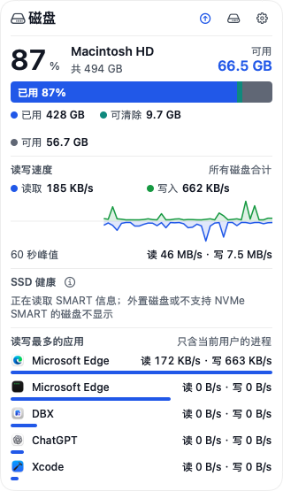

<div align="center">


# XStats

**무료 오픈소스 macOS 메뉴 막대 시스템 모니터.** CPU, 메모리, 네트워크, 온도를 한눈에 보고, 바로 정리·팬 제어·잠자기 방지까지 할 수 있습니다.

[](https://github.com/ysicing/xstats/releases)
[](https://github.com/ysicing/xstats/actions/workflows/ci.yml)
[](https://github.com/ysicing/xstats/releases)
[](LICENSE)

[다운로드](https://github.com/ysicing/xstats/releases) · [변경 기록(중국어)](CHANGELOG.md) · [개발 안내(중국어)](DEVELOPMENT.md)

[简体中文](README.md) · [English](README.en.md) · [日本語](README.ja.md) · **한국어**


</div>

```bash
brew tap ysicing/tap
brew trust ysicing/tap
brew install --cask xstats
```

## XStats를 쓰는 이유

- **앱 하나로 여러 가지**: 시스템 모니터링, 팬 제어, 잠자기 방지, 캐시 정리, 앱 제거, 속도 테스트, IP 확인을 메뉴 막대에서 모두 사용할 수 있습니다.
- **네이티브·오픈소스·무료**: Swift와 SwiftUI로 개발했으며 소스는 AGPL-3.0으로 공개되어 있고 계정이 필요 없습니다.
- **실행 전에 확인**: 정리와 앱 제거는 처리할 항목을 먼저 보여 주고 확인한 뒤에만 실행합니다. 먼저 휴지통으로 옮기도록 설정할 수도 있습니다.
- **보고 싶은 것만**: 메뉴 막대 항목, 순서, 표시 스타일을 고를 수 있고 쓰지 않는 모듈은 통째로 끌 수 있습니다.
- **9가지 인터페이스 언어**: 简体中文, 繁體中文, English, 日本語, 한국어, Deutsch, Español, Français, العربية.

<p align="center">
  
  
</p>

## 주요 기능

**시스템 모니터링**: CPU, GPU, 메모리, 디스크, 네트워크, 배터리, 온도, 팬 중에서 메뉴 막대에 표시할 항목을 고릅니다. 항목을 열면 기록, 많이 사용하는 앱, 하드웨어 세부 정보를 볼 수 있습니다.

<p align="center">
  
  
  
  
</p>

**시스템 도구**: 팬 제어, 잠자기 방지(덮개를 닫은 상태 포함), 앱 제거, 로그인 항목 관리. 캐시와 프로젝트 빌드 산출물 정리는 설정에서 켜면 사용할 수 있습니다.

**네트워크 도구**: 연결, DNS, 공인 IP를 확인하고, 필요할 때 속도 테스트와 IP 순도, 세계 각지로의 연결 상태를 점검합니다.

**선택 모듈**(기본값 꺼짐):

- 프로세스: 모든 프로세스를 보고 검색, 정렬, 앱별 그룹화 및 종료를 할 수 있습니다.
- 메뉴 막대 달력: 음력, 중국 공휴일과 대체 근무일, 역서에 더해 캘린더 일정과 미리 알림도 표시합니다.
- 뽀모도로와 눈 휴식: 모든 디스플레이에 휴식 화면을 띄우며 언제든 건너뛰거나 일시 정지하거나 미니 HUD로 줄일 수 있습니다.
- AI 사용량: Codex / Claude Code의 로컬 토큰 사용량과 구독 한도를 확인합니다.

**데스크톱 위젯**: 시스템 개요, 뽀모도로, AI 한도, 달력과 월 달력, "내일 출근?", IP 순도, 공인 IP.

## 설치

**Apple Silicon Mac과 macOS 14 이상**이 필요합니다. 위의 Homebrew 명령으로 설치하는 것을 권장하며, 업데이트는 `brew upgrade --cask xstats`로 할 수 있습니다.

[GitHub Releases](https://github.com/ysicing/xstats/releases)에서 DMG를 내려받거나 [소스에서 빌드](DEVELOPMENT.md)할 수도 있습니다. 앱이 직접 업데이트를 확인하며, 설치 여부는 사용자가 결정합니다.

## 데이터와 개인정보

계정은 필요하지 않습니다. 다음 기능은 네트워크에 접속하며, 모두 설정에서 끄거나 필요할 때만 사용할 수 있습니다.

- **업데이트 확인**: 앱 버전과 설치 ID의 해시를 보냅니다.
- **AI 사용량**(기본값 꺼짐): 로컬 Codex / Claude CLI 로그인으로 구독 한도를 확인하며, Sub2API를 예비 소스로 설정할 수 있습니다.
- **공인 IP, 속도 테스트, 연결 테스트**: 사용할 때만 해당 서비스에 접속합니다.

자세한 내용은 [개인정보 처리방침(영어)](Packages/XStatsKit/Sources/XStatsUI/Resources/Legal/Privacy.en.md)과 [서비스 약관(영어)](Packages/XStatsKit/Sources/XStatsUI/Resources/Legal/Terms.en.md)을 확인하세요.

## 빌드와 기여

Xcode 26+, Go 1.25+, [Go Task](https://taskfile.dev/), [XcodeGen](https://github.com/yonaskolb/XcodeGen)이 필요합니다. 주요 명령:

```bash
task test
task build BUMP=0 INSTALL=0
```

Issue와 Pull Request를 환영합니다. 환경 설정과 릴리스 과정은 [DEVELOPMENT.md(중국어)](DEVELOPMENT.md), 구조는 [ARCHITECTURE.md(영어)](ARCHITECTURE.md)을 참고하세요.

## 변경 기록

최신 변경 사항은 [CHANGELOG.md(중국어)](CHANGELOG.md)를 확인하세요.

## 감사와 라이선스

XStats는 [OpenStats](https://github.com/gentpan/OpenStats)를 기반으로 개발되었습니다. 원 프로젝트와 [ThirdPartyNotices.md](ThirdPartyNotices.md)에 명시한 다른 오픈 소스 프로젝트에 감사드립니다. XStats는 Apple 및 본문에 언급한 회사와 관계없는 독립적인 서드파티 앱입니다.

XStats의 새 코드와 수정 부분에는 **AGPL-3.0-or-later**가 적용됩니다. [LICENSE](LICENSE)와 [LICENSING.md(중국어)](LICENSING.md)를 확인하세요. 기존 OpenStats 코드는 [MIT 라이선스](LICENSES/OpenStats-MIT.txt)를 유지합니다.
