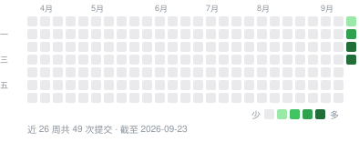

# XStats

**Mac 的状态，抬眼就看见——CPU、GPU、内存、网络与温度常驻菜单栏，还能调风扇、防休眠、一键清理、卸载应用，检测 IP 纯净度。**

XStats 是一款 macOS 菜单栏应用，实时显示 Mac 正在做什么：各核心 CPU 负载、GPU、内存压力、
网速、磁盘、电池、温度和风扇，并且可以直接处理：给风扇提速、合盖后继续运行、清理缓存、彻底卸载应用、停用启动项；
网络详情还能检测公网 IP 的纯净度，看出出口是否被标记为 VPN、代理、机房或有滥用记录。
所有监控指标都在你自己的 Mac 上读取，不会上传。不需要 XStats 账号，可通过自己的 WebDAV 服务器手动备份和恢复偏好设置。检查更新时会发送当前版本和随机安装标识的 SHA-256，用于匿名安装与版本分布统计；原始随机值只保存在本机钥匙串。其他可关闭的联网功能包括：打开网络详情时查询公网 IP 与纯净度、定时 ping 你选择的探测目标，以及每天检查一次新版本。

[下载](https://github.com/ysicing/xstats/releases) ·
[更新日志](CHANGELOG.md) ·
[开发指南](DEVELOPMENT.md)

**简体中文** · [English](README.en.md) · [日本語](README.ja.md) · [한국어](README.ko.md)

---

## 安装

在 [GitHub Releases](https://github.com/ysicing/xstats/releases) 下载 Apple Silicon 版 XStats。
若尚无构建可下载，请参考 [开发指南](DEVELOPMENT.md) 从源码构建。

XStats 暂无官网。自动更新与现有 GeoIP 服务保持不变；账号登录已替换为手动 WebDAV 同步。
更新安装仍严格检查应用身份与签名：旧服务提供的 OpenStats 安装包不能替换 XStats。

需要 Apple 芯片和 macOS 14（Sonoma）或更高版本。
界面支持简体中文、繁體中文、日本語、한국어、English、Deutsch、Español、Français 和 العربية。
默认自动检测系统首选语言，可在“设置 · 通用 · 语言”中搜索并切换；阿拉伯语使用从右到左布局。

## 最近更新

<!-- changelog:start -->
<!-- 由 Scripts/sync_changelog.py 从 CHANGELOG.md 生成，请勿手改。 -->

最新版本 **0.7.1**（2026-09-22） · [完整更新日志](CHANGELOG.md)

<b>2026-09-22</b> · 0.7.1 · 新增 1 · 调整 2

**新增**

- 清理页新增 npm、Yarn、pnpm、Bun、Go、Rust 与 uv 缓存，使用对应工具命令执行清理；工具缺失或命令失败时保留原缓存并显示原因。

**调整**

- 开发工具缓存首次不勾选，并记住用户在本机的选择；为各工具增加品牌图标，清理结果按执行前后实际占用计算。
- 辅助工具设置不再显示签名团队标识，只提示已使用 Developer ID 签名。

<b>2026-09-20</b> · 0.7.0 · 新增 2 · 调整 1

**新增**

- 语言设置支持搜索下拉选择、自动检测和选中标记，增加繁体中文、日语、韩语、德语、西班牙语、法语与阿拉伯语；阿拉伯语使用从右到左布局，语言偏好继续参与 WebDAV 设置备份。
- 设置同步改用 WebDAV：配置已有 HTTPS 目录、用户名和密码，手动上传本机设置或下载后确认应用。密码只存本机钥匙串，备份不包含监控数据、历史记录和连接凭据；文件大小、格式与版本校验失败时保持本机设置不变。

**调整**

- 移除 GitHub、Google、Apple 账号登录及后台自动同步，不再依赖原账号服务和登录回调。自动更新及 GeoIP 服务保持现状。

<!-- changelog:end -->

## 活跃度

  

  <a href="https://star-history.com/#ysicing/xstats&Date">
    <picture>
      <source media="(prefers-color-scheme: dark)" srcset="https://api.star-history.com/svg?repos=ysicing/xstats&type=Date&theme=dark">
      
    </picture>
  </a>

## 界面一览

  
  

## 数据显示在哪里

**菜单栏**

- 八种风格整体选择、统一套用：双行文字、单行文字、图标、圆环、饼图、柱状历史、电量条、状态圆点；
  也可以给个别指标单独指定。设置里每种风格都有示例预览，并说明图形代表什么。
- 网速可选双行圆点、双行箭头或单行：绿色上传、蓝色下载，始终带单位（`KB/s`、`MB/s`、`GB/s`）。
- 字号小而统一：两行布局 7pt 标签加 10pt 数值，单行 11pt，网速 9pt；数值等宽，刷新时菜单栏不抖动。
  鼠标悬停显示完整读数。

**详情弹窗**——每个指标一个菜单栏图标，点击弹出该项的窄详情，显示哪些区块可在设置里勾选；按 `Esc` 关闭。

- **CPU**：占用与状态、与 30 秒前的变化、CPU 温度与余量、1 / 3 / 5 分钟走势；核心热力图与此刻各核心占用；核心分工与频率；排队程度（每核平均负载与趋势）；按应用汇总。
- **内存**：还可用多少与压力走势；内存水位条；压缩省下的内存与交换区读写；按应用汇总。
- **网络**：流量历史；连接探测格子（通了是绿格、不通是红格，最近 60 次）；接口、Wi-Fi 信号、VPN / 代理；本地与公网 IPv4 / IPv6，
  归属地国旗、ASN；IP 纯净度评分与 F 到 A+ 等级、风险标记（VPN、代理、Tor、机房、滥用记录）；DNS 一键刷新，一键切换 Cloudflare、Google、腾讯、阿里云或手动填写；各进程流量。
- **磁盘**：启动磁盘容量分段条（已用、可清除、可用）；读写速度与 60 秒走势；SSD 健康；读写最多的应用。
- **GPU**、**温度与风扇**：使用历史、各组温度、风扇转速与快捷模式。
- **电池**：电量与剩余 / 充满时间、适配器功率与电池温度；最近 24 小时电量曲线；功耗；健康度与循环次数；已连接蓝牙设备的电量（AirPods、妙控键盘 / 鼠标 / 触控板）。没有电池的 Mac 只显示蓝牙设备。

  
  
  

**IP 纯净度检测**——网络详情里直接看出口 IP 干不干净：CleanIP.io 纯净度评分与 F 到 A+ 等级色带，风险评分与命中的
风险标记（VPN、代理、Tor、机房、滥用记录等）；IP 地址区块用徽章标出原生 / 广播、住宅 / 机房。IPv4 与 IPv6 分别检测，
结果在本机缓存 7 天，换了 IP 或点刷新才重查。

  
  

**主窗口**——左侧边栏切换仪表盘、本机信息、历史、CPU、GPU、内存、磁盘、网络、温度与风扇、电池，以及进程、启动项、防休眠、清理、卸载应用几个工具，宽高都可调整。
仪表盘有健康评分、芯片与系统徽章、三列指标卡片、核心负载、电池、高占用进程和快捷开关；清理见[清理](#清理)。

**用 Apple 智能解释进程**——看不懂的进程右键「用 Apple 智能解释」，由系统自带的本机大模型说明它是什么、占用是否正常、能否退出。
不接入第三方 AI，不联网；需要 macOS 26 并开启 Apple 智能，回答可能不准确，结束进程前请自行确认。

浅色为白底蓝色、深色为黑底蓝色，窗口与弹窗统一外观，可一键切换或跟随系统。

  
  

## 风扇与睡眠

| 风扇模式 | 行为 |
|---|---|
| 自动 | 交还 macOS 温控 |
| 降温 | 固定在最低到最高转速之间的 60% |
| 强冷 | 最高转速 |
| 自定义 | 用滑块在风扇转速范围内自由设定 |

自定义模式下，CPU 一旦达到安全温度（默认 95°C）就交还系统控制。退出 XStats 或应用崩溃时，
风扇恢复自动。合盖运行在使用电池且电量低于你设定的下限时自动关闭。

这两项需要系统权限，由一个通过 `SMAppService` 注册的小型辅助工具完成，首次使用时在
“系统设置 › 通用 › 登录项”中批准一次。辅助工具只提供固定的几个操作：设置风扇目标转速、恢复自动、
切换 `pmset disablesleep`、刷新 DNS 缓存、释放内存，**不执行任意命令**。它会校验调用方的代码签名，
应用断开连接时恢复风扇与睡眠设置；异常退出后，下次开机也会恢复。

## 清理

- **扫描范围**：应用缓存、日志与崩溃报告、浏览器缓存（Chrome、Edge、Brave、Arc、Firefox、Safari）、
  Xcode 编译缓存、模拟器缓存、npm / Yarn / pnpm / Bun / Go / Rust / uv 缓存、Xcode 归档、未完成的下载、安装包和废纸篓。
- **先预览**：按类别显示大小，每条规则可展开查看具体项目，清理前再确认一次。缓存与日志直接删除，
  空间立即释放；下载目录的内容移到废纸篓。开发工具缓存由对应工具命令清理，不直接删除内部目录；
  “缓存也先移到废纸篓”仅作用于目录型缓存。开发工具缓存首次不勾选，之后会记住本机的勾选状态。
- **安全**：只处理白名单目录。钥匙串、密码管理器、VPN、Cookie、历史记录一律不碰。正在运行的应用的缓存
  会跳过，浏览器需要先退出，删除前每一项都会再校验一次。所有操作记录在 `~/Library/Logs/XStats/cleanup.log`。
- **系统维护**：刷新 DNS 缓存、释放内存。已安装辅助工具时直接执行，否则请求一次管理员授权。

## 卸载应用与启动项

- **卸载应用**：列出“应用程序”里的第三方应用及其体积，选中或把应用拖进来，找出它留在资源库里的应用数据、缓存、
  偏好设置、沙盒容器、窗口状态、日志、网页数据和登录启动项，可逐项取消勾选；确认后连同应用一起移到废纸篓（可放回），
  并从程序坞移除图标。只匹配应用包名与同名目录，系统自带和 Apple 的应用不列出，正在运行的应用会提示先退出。
- **启动项**：列出当前用户、所有用户的 LaunchAgents 和系统 LaunchDaemons，显示所属应用、可执行文件、是否登录时运行 /
  保持运行，以及运行中、已加载、已停用状态。当前用户的启动项可以直接停用或重新启用（写入 launchd 停用记录并卸载，
  不删除文件），其余只读，并提供系统登录项设置的入口。

## 你的数据

指标来自本机的内核接口（`host_processor_info`、`host_statistics64`、`sysctl`）、IOKit 与 SMC。
偏好设置保存在应用自己的 user defaults 中，不含个人信息。监控指标、历史记录、硬件序列号和进程列表不会上传。

会联网的功能都可以关闭。前两项在“设置 → 网络”中，检查更新在“设置 · 关于”中：

- **公网 IP**：打开网络详情时向 Cloudflare `1.1.1.1`（回退 ipify）请求一次公网地址，10 分钟内不重复请求。归属地、ASN、网络类型与纯净度评分由这台 Mac 直接向 `cleanip.io` 查询，只发送公网地址、不经过我们的服务器；地址没变、不满 7 天就沿用上次结果，点刷新才重查。
- **连接探测**：打开网络详情时每秒（后台每 10 秒）向你选择的目标（Cloudflare、Google、阿里云、腾讯或路由器）发送一次 ICMP ping，只在菜单栏显示网络项或打开网络详情时运行。
- **检查更新与安装统计**：启动时与之后每天发送当前版本和随机安装标识的 SHA-256，并读取版本清单。中国地区优先使用 `x-stats.china.12306.work`，其他地区优先使用 `xstats-apps.12306.work`，首选失败才串行回退到另一个，首次成功后停止。服务端只保存该哈希、当前版本、首次与最近检查时间及检查次数，不保存硬件序列号，也不持久化请求 IP（IP 只用于一分钟内的内存限流）。原始随机值只在本机钥匙串中。关闭自动检查更新后不会再自动请求；发现新版本时仍由你决定是否安装。

WebDAV 只向你配置的服务器传输偏好设置，不上传监控数据、历史记录或 WebDAV 凭据。

### WebDAV 设置同步

1. 在 WebDAV 服务器上创建目录，打开 **设置 → 设置同步**。
2. 填写该目录的 HTTPS 地址、用户名和密码（或应用专用密码），保存配置。支持 Basic 认证，需要有效的 HTTPS 证书；不跟随重定向，请填写最终目录地址。
3. 点击“上传本机设置”，确认后写入 xstats-settings.json，替换远端同名文件，不合并其他 Mac 的改动。
4. 在另一台 Mac 配置相同目录，点击“下载并应用”；备份校验通过后，再确认覆盖本机对应偏好。

第一版仅手动同步，不在启动、唤醒或设置变更时自动上传。每台 Mac 需要单独配置连接信息，密码仅存本机钥匙串。
XStats 不对远端 JSON 文件额外加密，请使用私有 WebDAV 目录。首次使用需要先上传，才能在其他设备下载。
超过 1 MB、格式无效或版本不受支持的备份会被拒绝，本机设置保持不变。
GitHub、Google、Apple 登录及旧账号后端已移除，设置同步只需要你自己的 WebDAV 服务器。

用 Apple 智能解释进程完全在本机完成，进程信息不会离开这台 Mac。

## 开发者

二次开发、构建、测试、版本号、签名发布和项目结构见
[DEVELOPMENT.md](DEVELOPMENT.md)。深入架构说明见 [ARCHITECTURE.md](ARCHITECTURE.md)。

## 致谢

XStats 基于以下开源项目，谢谢。

| 项目 | 作者 | 许可证 | XStats 借鉴了什么 |
|---|---|---|---|
| [OpenStats](https://github.com/gentpan/OpenStats) | GiantAccel, LLC | MIT | XStats 的上游项目，感谢原项目的开源贡献 |
| [Stats](https://github.com/exelban/stats) | Serhiy Mytrovtsiy | MIT | SMC 访问、Apple Silicon 风扇解锁流程、菜单栏迷你样式的字号参数 |
| [Mole](https://github.com/tw93/Mole) | tw93 | GPL-3.0 | 哪些目录值得清理、哪些绝对不能碰；清理模块为独立的 Swift 实现，不含 Mole 代码 |
| [QuotaBar](https://github.com/gentpan/quotabar) | GiantAccel, LLC | MIT | 本 README 的版式、更新日志同步与活跃度图脚本 |

详见 [ThirdPartyNotices.md](ThirdPartyNotices.md)。

XStats 是独立的第三方应用，与 Apple 及文中提到的其他公司没有隶属、认可或赞助关系。相关名称与标志归各自所有者所有。

## 许可证

XStats 新增代码与修改采用 **AGPL-3.0-or-later**，见 [LICENSE](LICENSE) 与 [许可范围及贡献要求](LICENSING.md)。

OpenStats 上游代码保留原 [MIT 许可与版权声明](LICENSES/OpenStats-MIT.txt)，其他第三方许可见 [ThirdPartyNotices.md](ThirdPartyNotices.md)。
